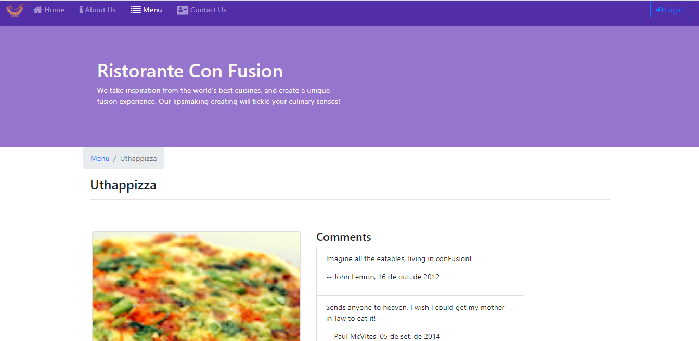
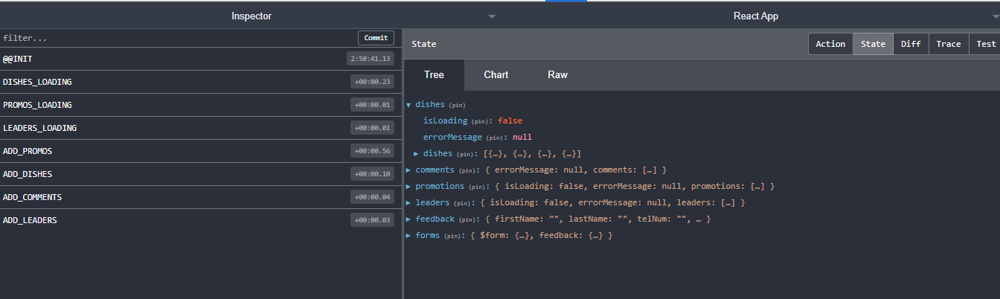

# Ristorante Con Fusion

> Front-End Web Development with React - Coursera



## Project Structure

### React

React it used to construct User Interface, rendering react components on the client-side, it is possible to render on the server side and send to the client using ReactDOMServer, but I've never used this object.

### json-server

To fetch data about dishes, comments, promotions, leaders and post a feedback to a server, we use json-server to set up a REST API for our application. Further, we use this server to deploy our application.

### Redux



Redux is used to handle state management in our application, is the data store in our client-side. To use react with redux, there's a package called react-redux, that provides Provider Container Component, to pass information as props to our application and connect method, so that we can export a component connected to Redux store in our app. It also provides hooks such as useSelector, useStore to interact with the store.

### Deployment

The application is deployed using json-server. Inside the public folder we put the static files, such as html, images, javascript and css files in there. A nice thing that I learned studying this project and reading create-react-app documentations, is that you can get the same result using [Express](https://expressjs.com/en/starter/static-files.html) to serve static files.

## Learning Process

### useCallback & Component Life Cycle

Take a look in the following code:

```
	const validate = ({firstName}) => {
		if(state.touched.firstName) {
		...
	}
	useEffect(() => {
		validate(state.firstName, state.lastName, state.telNum, state.email)
	}, [validate, state.firstName, state.lastName, state.telNum, state.email])
```

Notice that when occurs an update in the Component state, the component will re-render, and the reference of validate function will be different, with a new closure (the environment when the function was created). But, because validate is a dependency in our effect, if it has changed, it will run the effect (even if is not necessary).
Then we have 3 approaches:

- Put validate in the callback, so we get useEffect(validate, [state.firstName]), so isn't a dependency
- Declare validate within the effect, so isn't a dependency
- wrap the validate function in useCallback hook, is effect's dependency, but only creates a new reference if the dependencies of validate function have changed. Otherwise, same input, same output, nothings has changed. Notice that the state.touched.firstName is a dependency, is an external information.

ESLint will help us to fix it showing the following error:

`"The 'validate' function makes the dependencies of useEffect Hook (at line 96) change on every render. Move it inside the useEffect callback. Alternatively, wrap the definition of 'validate' in its own useCallback() Hook react-hooks/exhaustive-deps"`

To fix this we can:

```
const validate = useCallback(({firstName}) => {
	if(state.touched.firstName) {
		...
	}, [state.touched.firstName])
```

The flow of a component, the Life Cycle when the component gets updated within its state is like this:

State update -> re-render Component, return or render method -> useEffect, parse the effect dependencies, state.touched.firstName has changed, useCallback notice that and update validate reference, so run effect (validate and state.firstName also changed) -> inside validate, update errors state -> re-render Component -> useEffect does not run, since validate hasn't changed its reference and state.firstName is still the same.

We get the following flow: stateUpdate -> re-render -> useEffect -> stateUpdate -> re-render.

I definitely recommend a good read in this docs - https://reactjs.org/docs/hooks-faq.html
and this video about useCallback - https://www.youtube.com/watch?v=_AyFP5s69N4&ab_channel=WebDevSimplified

### Component Closure

The following code is an example of Closure issue:

```
useEffect(() => {
    console.log(appContext.product)
    getProduct(params.id)
    console.log(appContext.product)
  }, [])
```

Of course, that It follows the logic own javascript, according react documentations, "Any function inside a component, including event handlers and effects, “sees” the props and state from the render it was created in."

Another words, the backpack of variables in a function, closure or its environment it's seen when the function was created, when the function inside useEffect was created, appContext.product was an empty object, and even after update being updated by getProduct(), it will continue showing an empty object, since the effect lives longer, even after state update and re-render.

In my [final project](https://github.com/NietoCurcio/SellerFinder) to conclude this course, there is more detailed explanation of my thought process about Closure and useEffect.

### react-router, withRouter and render

When you need pass props to a component that is handled by router, you can use the render attribute in Router, so that is not needed create a new Component just to pass props to another component (so you do not create a unnecessary new component every render, you just need to update the existing component, not mount a new). [render: func](https://reactrouter.com/web/api/Route/render-func)

`export default withRouter(connect(mapStateToProps, mapDispatchToProps)(Main))`

with the withRouter function, we have a good way to access router properties like location, history and match.

## About this Course

Front-End Web Development with React is part of a specialization that contains four courses, the
Full-Stack Web Development with React in Coursera, a platform that offers online courses provided by universities around the World. The author of this Course is Jogesh K. Muppala an associate professor in the Department of Computer Science and Engineering, The Hong Kong University of Science and Technology.

## Linkedln

Here you can find me on [Linkedln](https://www.linkedin.com/in/felipe-antonio-nieto-curcio-9b865116a/)
